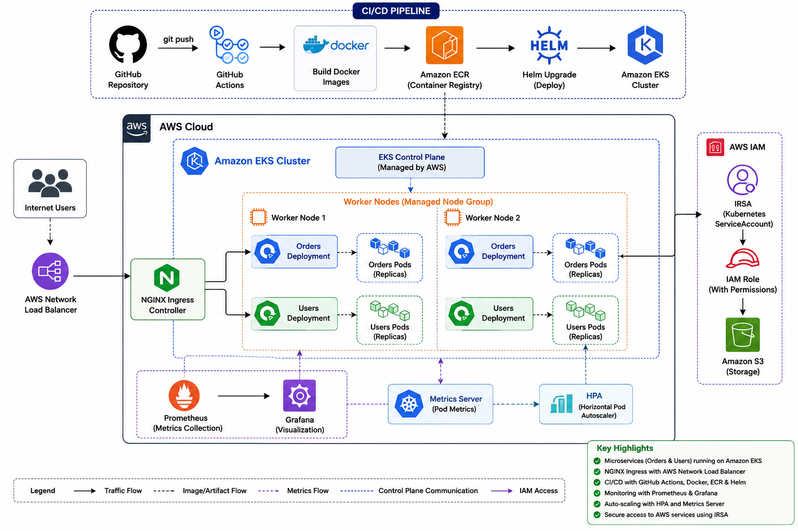
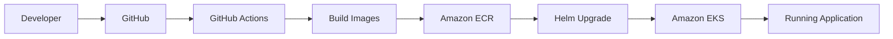
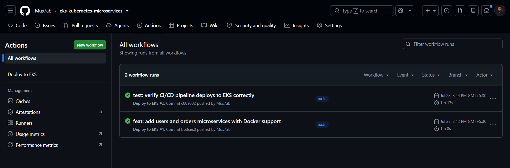
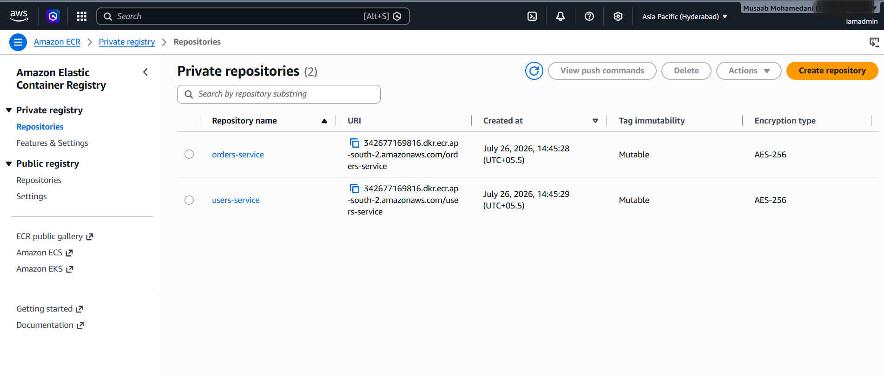
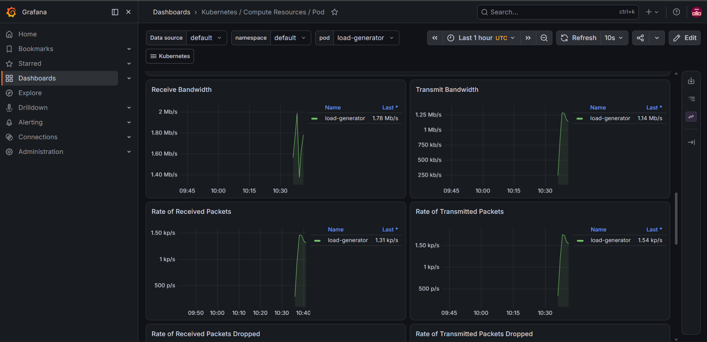

# Kubernetes Production Deployment on Amazon EKS

A production-style Kubernetes deployment of two microservices (**orders**, **users**) — built locally with `kind` first, then deployed to Amazon EKS with Helm, Ingress, ConfigMaps/Secrets, IRSA, Prometheus/Grafana monitoring, Horizontal Pod Autoscaling, and a GitHub Actions CI/CD pipeline.

---

## Problem Statement

A growing microservices platform needs to move beyond ECS Fargate (Project 2) to Kubernetes — the cloud-agnostic orchestration standard referenced in nearly every senior Gulf DevOps posting. This project builds genuine, hands-on Kubernetes competency: from raw Pods and Deployments, through Helm packaging, Ingress routing, secrets management, fine-grained AWS identity (IRSA), production observability (Prometheus/Grafana), automatic scaling (HPA), and a working CI/CD pipeline — all verified on a real EKS cluster, not just locally.

## 🛠 Skills Demonstrated

- Amazon EKS
- Kubernetes
- Helm
- Docker
- Amazon ECR
- GitHub Actions
- CI/CD
- IAM
- IRSA (IAM Roles for Service Accounts)
- Prometheus
- Grafana
- Horizontal Pod Autoscaler (HPA)
- NGINX Ingress
- ConfigMaps
- Secrets
- AWS Load Balancer Controller

---

## 🏗️ Architecture



The application is deployed on Amazon EKS and follows a production-style architecture. GitHub Actions builds and pushes container images to Amazon ECR, then deploys both services to EKS using Helm. Traffic enters through an AWS Network Load Balancer and NGINX Ingress, while Prometheus, Grafana, Metrics Server, and HPA provide monitoring and autoscaling. AWS access from workloads is secured using IRSA with least-privilege IAM roles.

---
> **Deployment Flow**



## 📸 Project Screenshots

### 🚀 GitHub Actions CI/CD

The pipeline automatically builds Docker images, pushes them to Amazon ECR, and deploys the application to Amazon EKS using Helm.



---

### 📦 Amazon ECR Repositories

Container images for the Orders and Users services are versioned and stored in Amazon ECR before deployment.



---

### 📊 Grafana Monitoring Dashboard

Prometheus collects metrics from the Kubernetes cluster while Grafana visualizes them through production-style dashboards.



---

## AWS Services & Tools Used

| Service/Tool | Purpose |
|---|---|
| kind | Free, local Kubernetes cluster for all Day 1-4 development |
| Helm | Templated, reusable Kubernetes packaging (one chart, two services) |
| NGINX Ingress Controller | Path-based HTTP routing, both locally (NodePort) and on EKS (AWS NLB) |
| Amazon EKS | Managed Kubernetes control plane |
| Amazon ECR | Stores versioned, SHA-tagged container images |
| IRSA (IAM Roles for Service Accounts) | Pod-level AWS identity, independent of the worker node's role |
| kube-prometheus-stack | Prometheus, Grafana, Alertmanager — real-time and historical metrics |
| Horizontal Pod Autoscaler | Automatic replica scaling based on live CPU utilization |
| GitHub Actions | CI/CD: build, push to ECR, deploy via Helm to EKS |

---

## Repository Structure

```
eks-kubernetes-microservices/
├── .github/
│   └── workflows/
│       └── deploy-eks.yml
├── configs/
│   ├── orders-configmap.yaml
│   └── orders-secret.example.yaml
├── eks/
│   └── cluster-config.yaml
├── hpa/
│   └── orders-hpa.yaml
├── images/
│   ├── architecture.png
│   └── screenshots/
│       ├── aws-ecr.png
│       ├── github-actions-success.png
│       └── grafana-dashboard.png
├── ingress/
│   └── orders-users-ingress.yaml
├── orders-chart/
│   ├── templates/
│   ├── Chart.yaml
│   └── values.yaml
├── services/
│   ├── orders/
│   │   ├── Dockerfile
│   │   ├── app.js
│   │   └── package.json
│   └── users/
│       ├── Dockerfile
│       ├── app.js
│       └── package.json
├── kind-config.yaml
├── irsa-test-pod.yaml
└── README.md
```

---

## How to Deploy

### Local development (free, no AWS cost)
```bash
kind create cluster --name project3-local --config kind-config.yaml
kind load docker-image orders-service:v1 --name project3-local
kind load docker-image users-service:v1 --name project3-local
helm install orders-release ./orders-chart
helm install users-release ./orders-chart --set nameOverride=users-chart --set fullnameOverride=users-release --set image.repository=users-service
```

### Production (Amazon EKS — real cost, see Cost Estimate below)
```bash
eksctl create cluster -f eks/cluster-config.yaml
kubectl apply -f configs/orders-configmap.yaml
kubectl apply -f configs/orders-secret.yaml   # create your own from orders-secret.example.yaml first

helm install orders-release ./orders-chart \
  --set image.repository=<your-account-id>.dkr.ecr.ap-south-2.amazonaws.com/orders-service \
  --set image.pullPolicy=IfNotPresent \
  --set resources.requests.cpu=100m --set resources.requests.memory=64Mi

helm install users-release ./orders-chart \
  --set image.repository=<your-account-id>.dkr.ecr.ap-south-2.amazonaws.com/users-service \
  --set image.pullPolicy=IfNotPresent \
  --set nameOverride=users-chart --set fullnameOverride=users-release \
  --set resources.requests.cpu=100m --set resources.requests.memory=64Mi

kubectl apply -f hpa/orders-hpa.yaml
kubectl apply -f https://raw.githubusercontent.com/kubernetes/ingress-nginx/main/deploy/static/provider/aws/deploy.yaml
kubectl apply -f ingress/orders-users-ingress.yaml
```

**Important:** always run `eksctl delete cluster --name project3-eks --region ap-south-2` when done — this project follows a strict create → verify → destroy discipline (see Design Decisions).

---

## CI/CD

`.github/workflows/deploy-eks.yml` triggers on pushes to `services/orders/**`, `services/users/**`, or `orders-chart/**`. It builds both images (tagged with the commit SHA), pushes to ECR, and runs `helm upgrade --install` for both releases against a running EKS cluster — verified end-to-end with a real code change that produced a real, curl-confirmed response.

**Requires:** a dedicated IAM user (`github-actions-eks`) with AWS credentials in GitHub Secrets, *and* that same identity mapped into the cluster's RBAC via `eksctl create iamidentitymapping` — Kubernetes and IAM are two independent authorization systems, and this pipeline needed both.

---

## Design Decisions

**1. `kind` for all local development before ever provisioning EKS.** Every Day 1-4 concept (Pods, Deployments, Services, Helm, Ingress, ConfigMaps/Secrets) was built and debugged entirely for free. EKS was only introduced once the underlying Kubernetes concepts were already solid — minimizing expensive trial-and-error on billed infrastructure.

**2. One shared Helm chart for both microservices, not two separate charts.** Simpler to maintain and directly demonstrates Helm's templating value (one chart, two independently-configured releases via `--set` overrides). Tradeoff: sacrifices the true independent-chart deployability Project 2 achieved at the ECS layer — a real regression, named honestly rather than hidden.

**3. `eksctl` instead of hand-written Terraform for EKS cluster provisioning.** EKS bills hourly from the moment it exists; hand-writing Terraform for a cluster, node group, and OIDC setup risks many more error-prone retry cycles, each one costing real money. `eksctl` is a proven, AWS-maintained tool built specifically to minimize that risk.

**4. CI IAM user mapped to `system:masters` in the cluster's RBAC, not a scoped ClusterRole.** Broad, deliberate tradeoff for this learning project — same category as prior projects' `PowerUserAccess` choices. A production system would define a custom ClusterRole limited to `deployments`/`pods`/`services` in the `default` namespace only.

**5. Explicit `resources.requests`/`limits` added specifically to make HPA function correctly.** A real, discovered requirement, not a best-practice checkbox: HPA's percentage-based scaling has no baseline to calculate against without a defined CPU request. Diagnosed via `cpu: <unknown>` in `kubectl get hpa`, traced to the missing field, fixed, and verified with a live scale-up (2 → 4 → 5 replicas under real load).

**6. One combined GitHub Actions workflow deploying both services, not per-service pipelines.** Directly follows from Decision 2 — since both services share one chart, splitting the pipeline wouldn't restore true independence without also splitting the chart. A named, explicit simplification for this project's scope.

**7. Configuration and secrets externalized via ConfigMaps and Secrets, not hardcoded.** Keeps the same container image deployable across environments; configuration changes without rebuilding. Tradeoff: more Kubernetes objects to manage, and Kubernetes Secrets are only base64-encoded by default, not encrypted — a real, stated limitation (see Known Limitations).

**8. IRSA instead of node-level IAM permissions for AWS access.** Rather than every Pod inheriting the worker node's shared IAM role, the `orders` workload was given its own scoped IAM identity via IRSA, demonstrated by successfully reading a specific S3 object using only that Pod's own temporary credentials. Tradeoff: real setup overhead (OIDC provider, IAM trust policy, ServiceAccount annotation) — but the correct, least-privilege pattern for any real multi-tenant cluster.

**9. Strict create → verify → destroy discipline for every EKS session.** Given EKS's hourly, no-free-tier cost, every cluster across Days 5-8 was created fresh, fully verified, and torn down before the session ended — including two real mid-session incidents (a stuck node drain, and an approaching session-limit with a live cluster) both resolved by prioritizing teardown over completing planned work.

**10. Managed EKS networking via `eksctl` defaults, not custom VPC engineering.** This project's focus was Kubernetes operations — Helm, Ingress, IRSA, monitoring, autoscaling, CI/CD — not networking design, which was already demonstrated extensively in Project 1's hand-built VPC. A deliberate scope boundary, not an omission.

---

## Known Limitations / What I'd Improve at Scale

- Kubernetes Secrets are only base64-encoded by default; real production secret management would integrate AWS Secrets Manager or KMS-backed encryption
- CI IAM user has `system:masters` cluster-admin RBAC rather than a scoped ClusterRole
- No HTTPS/TLS on the Ingress yet — pending an ACM certificate and cert-manager integration
- Only `orders` has IRSA configured; `users` would need its own scoped role for any future AWS integration
- No Cluster Autoscaler / Karpenter — HPA scales Pods, but node-level scaling (adding EC2 capacity when Pods can't be scheduled) isn't configured
- The GitHub Actions workflow deploys `orders`/`users` but not the monitoring stack or HPA — those remain one-off, same-session demonstrations rather than standing infrastructure

---

## Cost Estimate

*(Real, verified figure — see Section 2 of Day 9 in the project log; filled in after checking AWS Billing Console.)*

Approximate on-demand costs if run continuously: EKS control plane ~$0.10/hour (~$73/month), 2x `t3.small` worker nodes ~$0.03/hour combined, AWS NLB ~$16-20/month + LCU usage. This project's actual cost was deliberately minimized through the create → verify → destroy discipline across 4 separate cluster sessions (Days 5, 6, 7, 8).

---

## Teardown

Every session ends with:
```bash
eksctl delete cluster --name project3-eks --region ap-south-2
```
Verified clean via `aws eks describe-cluster` (expect `ResourceNotFoundException`), `aws ec2 describe-instances`, and `aws cloudformation list-stacks` after every single session, including two real incidents where a stuck node drain required proactively identifying and force-deleting unschedulable CoreDNS/metrics-server Pods before deletion could proceed.

---

## Lessons Learned

- Kubernetes concepts map directly onto AWS concepts learned in Projects 1-2 (Deployment ≈ ASG/ECS Service, Service ≈ Target Group, Ingress ≈ ALB) — but the underlying mechanisms differ enough that assuming behavior transfers without verification causes real bugs (NodePort instability, admission webhook races).
- IAM and Kubernetes RBAC are two fully independent authorization systems — valid AWS credentials alone are never sufficient for `kubectl` to work.
- A passing CI/CD pipeline proves the *pipeline* ran correctly, not that the *deployment* is correct — HPA's silent `<unknown>` state and Project 2's task-definition bug are both instances of this same, generalizable lesson.
- Cost-sensitive infrastructure (EKS, unlike EC2/RDS/Fargate) requires genuinely different operational discipline — same-session teardown isn't optional, and real crisis moments (session limits, stuck drains) test whether that discipline actually holds under pressure, not just in theory.
